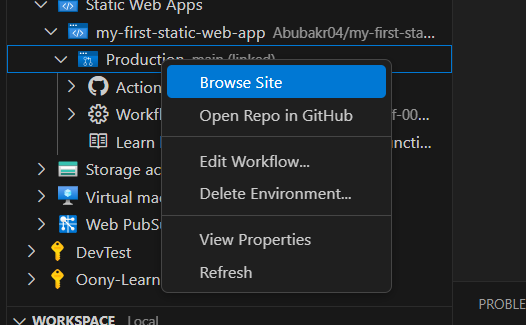

# Vanilla JavaScript App

[Azure Static Web Apps](https://docs.microsoft.com/azure/static-web-apps/overview) allows you to easily build JavaScript apps in minutes. Use this repo with the [quickstart](https://docs.microsoft.com/azure/static-web-apps/getting-started?tabs=vanilla-javascript) to build and customize a new static site.

This repo is used as a starter for a _very basic_ HTML web application using no front-end frameworks.

This repo has a dev container. This means if you open it inside a [GitHub Codespace](https://github.com/features/codespaces), or using [VS Code with the remote containers extension](https://code.visualstudio.com/docs/remote/containers), it will be opened inside a container with all the dependencies already installed.

# General steps for completing this lesson

1. Created repository from ready web-app template

2. Cloned the repo to our local machine.

3. Created Azure Static Web Apps through Azure Extension in VS Code

4. Selected Subscription

5. Entered the name of new static web app

6. Selected a region.

7. Selected **Custom** for project structure.

8. Entered the location of application code

9. Entered the location of build output.

10. Static Web App created successfully, clicked **Open Actions in GitHub** button

11.	Waited until project was built.

12. Then went to the VS Code and chose **Static Web Apps -> my-first-static-web-app -> Production** then clicked **Browse Site** button

13. As we can see that our static web site deployed successfully and it has the DNS record provided by Microsoft.

14.	In the Azure portal we can see the overview of the static web app.